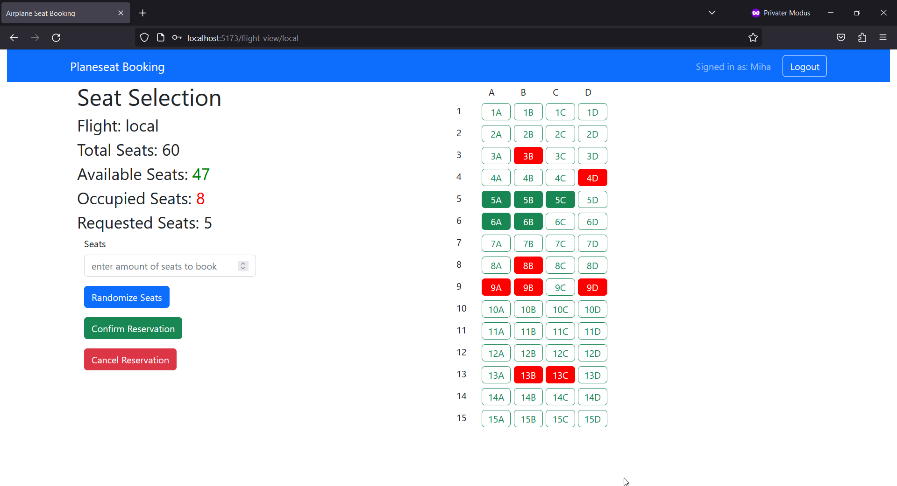

# Exam #2: "Airplane Seats"

## Student: s318364 BASSAUER DAVID 

# Server side

## API Server

  -  POST /api/login
      -  Request body content: { "username": string, "password": string }
      -  Response body content: { "id": number, "username": string, "name": string }

  -  GET /api/sessions/current
      -  No request parameters or body content required
      -  Response body content: { "id": number, "username": string, "name": string } or { "error": "Not authenticated" }

  -  DELETE /api/sessions/current
      -  No request parameters or body content required
      -  Response body content: {}

  -  GET /api/local-flight-allseats
      -  No request parameters or body content required
      -  Response body content: An array of seat information objects:
        { "id": number, "row": number, "seat": string, "occupied": number, "userid": number }

  -  GET /api/regional-flight-allseats
      -  No request parameters or body content required
      -  Response body content: An array of seat information objects (same as above)

  -  GET /api/international-flight-allseats
      -  No request parameters or body content required
      -  Response body content: An array of seat information objects (same as above)

  -  PATCH /api/reserve-seats
      -  User must be logged in
      -  Request body content: { "seatIds": Array of numbers, "flightType": "local" | "regional" | "international" }
      -  Response body content: { "success": boolean, "message": string }

  -  PATCH /api/cancel-reservation
      -  User must be logged in
      -  Request body content: { "flightType": "local" | "regional" | "international" }
      -  Response body content: { "success": boolean, "message": string }

  -  GET /api/check-user-reservation
      -  User must be logged in
      -  Query parameter: flightType which can be "local", "regional", or "international"
      -  Response body content: An array of seat information objects (same as above)

  -  GET /api/check-occupied-seats
      -  Query parameter: flightType which can be "local", "regional", or "international"
      -  Response body content: An array of seat information objects (same as above)

Example usage

Please refer to the test file for API usage examples. This file demonstrates how to format requests to the API, including how to pass the necessary JSON body content and query parameters.

## Database Tables

  -  **Table local_flights:**
      -  Purpose: Contains seat information for local flights.
      -  Columns:
          -  id: Unique seat identifier
          -  row: Integer value indicating the row of the seat
          -  seat: Letter indicating the specific seat within the row
          -  occupied: Boolean value indicating if the seat is occupied or not
          -  userid: ID of the user who has occupied the seat

  -  **Table regional_flights:**
      -  Purpose: Contains seat information for regional flights.
      -  Columns: The structure is identical to the local_flights table.

  -  **Table international_flights:**
      -  Purpose: Contains seat information for international flights.
      -  Columns: The structure is identical to the local_flights and regional_flights tables.

  -  **Table users:**
      -  Purpose: Contains information about registered users.
      -  Columns:
          -  id: Unique user identifier
          -  username: Username of the user
          -  hash: Hashed value of the user's password
          -  salt: Salt value used to hash the password
          -  name: Full name of the user

# Client side

## React Client Application Routes
Absolutely, here is the updated version:

- **Route `/`:**
  - *Page Content:* This route corresponds to the `PlaneSelectionLayout` component.
  - *Purpose:* This is the landing route for the application where the user can select the type of flight (local, regional, or international).

- **Route `/flight-view/:planetype`:** 
  - *Page Content:* This route corresponds to the `SeatSelectionLayout` component if the data is loaded, or the `LoadingLayout` component while data is loading.
  - *Purpose:* This is the route where the user can view and select available seats on the plane of a chosen type. 
  - *Parameter `planetype`:* A dynamic parameter that can be 'local', 'regional', or 'international' indicating the type of plane for the flight.

- **Route `/login`:** 
  - *Page Content:* This route corresponds to the `LoginLayout` component if the user is not logged in. If the user is already logged in, it will navigate to the landing route ('/').
  - *Purpose:* This is where the user can login to the application. If already logged in, it redirects to the landing page.

- **Route `*`:** 
  - *Page Content:* This route corresponds to the `NotFoundLayout` component.
  - *Purpose:* This is a fallback route which is shown when the user navigates to a route that does not match any of the defined routes. It displays a "404 Not Found".

## Main React Components

- `NavigationBar` (in `NavigationBar.jsx`): A navigation bar component that adjusts its content based on the user's login status. Displays the user's name when logged in, and provides login or logout buttons depending on the current state.

- `PlaneSelection` (in `PlaneSelection.jsx`): A component that displays the selection of flight types - local, regional, and international. Each flight type is represented by a card displaying the total number of seats and a "Book seats" link that redirects to the corresponding flight view.

- `LoginForm` (in `Auth.jsx`): This component provides the interface for users to login. It handles the submission of login credentials and displays any error messages in the event of a failed login attempt.

- `SeatView` (in `SeatSelection.jsx`): This component is responsible for rendering the seat selection interface for a specific flight. It receives the following props:
  - `loggedIn`: A boolean value indicating whether the user is logged in.
  - `user`: The user object containing user information.
  
  The main functionalities of this component are:
  - Retrieving the plane type from the URL parameter.
  - Fetching occupied seats and checking user reservations from the server.
  - Allowing users to select and reserve seats.
  - Displaying seat availability, including the total number of seats, available seats, and occupied seats.
  - Handling the logic for reserving random seats.
  - Showing alerts for seat availability changes and errors.
  
- `InformationBar` (in `SeatSelection.jsx`): This component displays information related to the selected flight and the seat selection process. It receives the following props:
  - `user`: The user object containing user information.
  - `occupiedSeats`: An array of occupied seat IDs.
  - `setReservedSeats`: A function to update the reserved seats.
  - `reservedSeats`: An array of reserved seat IDs.
  - `hasReservation`: A boolean value indicating whether the user has a reservation.
  - `setHasReservation`: A function to update the reservation status.
  - `setOccupiedSeats`: A function to update the occupied seats.
  - `currentPlane`: The object representing the current plane type.
  - `reserveRandomSeats`: A function to reserve random seats.
  - `setSelectedSeats`: A function to update the selected seats.
  - `selectedSeats`: An array of selected seat IDs.
  - `loggedIn`: A boolean value indicating whether the user is logged in.
  - `setLocalLoading`: A function to update the local loading state.
  - `takenSeats`: An array of seat IDs that are no longer available.
  - `setTakenSeats`: A function to update the taken seats.

  The main functionalities of this component are:
  - Displaying information about the selected flight, including flight type, total seats, available seats, and occupied seats.
  - Handling seat reservation confirmation, cancellation, and randomization.
  - Updating the UI based on changes in seat availability and user actions.
  - Showing alerts for seat availability changes and errors.

# Usage info

## Example Screenshot

## Users Credentials

- username: `user`, password: `password` (has reservation in local and international flights)
- username: `planefan`, password: `italy`(has reservation in regional and international flights)
- username: `carfan`, password: `germany`
- username: `polito`, password: `webapp`